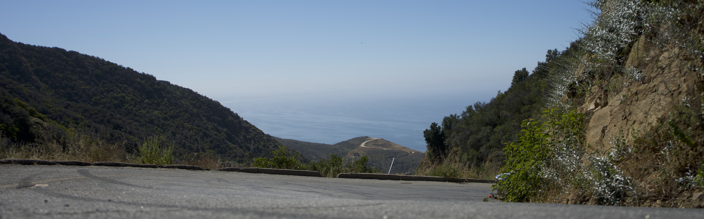
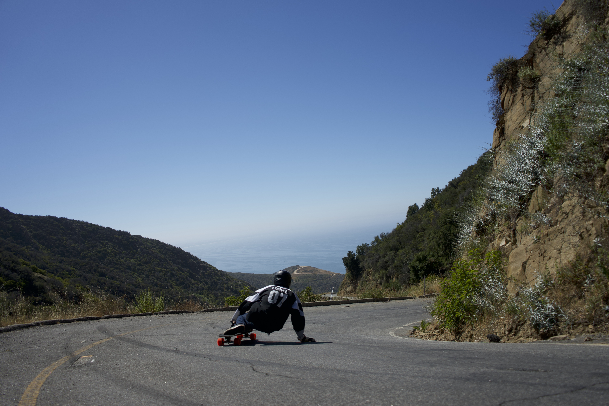

# Beginner Guide to Longboarding Tuna Canyon

# Intro

My college friend Ben and I recently did a trip to the famous one way in Malibu/Santa Monica to attempt to learn the mountain in the matter of 4 days.

|  |  |
|---|---|
| [Ben Lovell](https://www.instagram.com/ben__lovell/?hl=en) | Matt Garelli |

This was an ambitious endeavor, but we both saw it a milestone in our journey that started five years ago in a [parking garage in Stanford, CA](https://youtu.be/gvDXwlKnCUY) ripping corners and throwing our first pendulum slides. It was really a journey to become legitimate downhill longboarders.

My deep love of the sport really started through an internship I did at [Braden Boards](https://www.instagram.com/rojastrucks/?hl=en) working with Jared on some of the initial design concepts for the 30 degree baseplate, stress analysis of the axels, & various extraneous research on the effects of rake on stability as well as some CAD models for future designs. I also got a chance to shred with Chase and some of the Mo-luv crew in the stunning oasis for longboarding that exists in Southern Missouri. I was hooked, and I knew I wanted some more.

#### Quick Disclaimer
Neither Ben nor I are by any means professionals, and we went to this monster of a mountain to get down it alive and in some way, shape, or form get the concept of a Raw Run out of the adventure. Look elsewhere for a professional guide / breakdown of the run.

# Table of Contents
1. [Research](#summary)
2. [Equipment](#Equipment)
3. [Failing](#Failing)
4. [Sending](#Sending)
5. [Philosophy](#Philosophy)

# Research

So at this point, I have watched essentially every longboard video of the canyon that YouTube has to offer. But when it came down to a few weeks before the run I figured I'd pick one and try to do my own breakdown to understand at least one rider's approach to the sequence of turns. I chose [this guys run](https://www.youtube.com/watch?v=fMXz2o_92OI) because he hit a lot of the road and it was a textbook raw run. I broke down my plan to lose speed as follows:

1. first barrel
2. second sand mound (on the left)
3. hairpin
4. barrel with a white guard-rail
5. slide before and during the ridge
6. hidden barrel and guard rail
7. several mellower switch-backs
8. the crazy straight
9. mellow right
10. the fastest hard left
11. suprisingly fast hard left through the trees
12. some crazy fast rolling switch backs
13. final left into some chunder

I won't spoil the raw run too much, but I'll tell you that not everything went as planned. The speeds required are faster in real life and the nerve required to aim for the best line is tremendous. We hit many literal and figurative walls. The number one thing we lacked was comfort lightly 'tapping' into slides at 60mph.

# Equipment

All gear was assuming we were going to shred the gnar as much as possible for 4 days straight, so for a different length of time, you will need to scale appropriately

* Setups (1 extra Longboard, Ben almost lost one over a cliff day 1).

	| Rider | Truck Model | Front Baseplate | Front Width | Back Baseplate | Back Width | Deck |
	|---|---|---|---|---|---|---|
	| Matt | [Rojas](https://www.rojastrucks.com/) | 55° | 133 mm | 20° | 184 mm | [Vandal](https://www.daddiesboardshop.com/rayne-vandal-v3-lolo-longboard-deck) |
	| Ben | Ronin Precisions | 55° | 134 mm | 20° | 174 mm | [Genesis](https://www.muirskate.com/longboard/completes/71531/rayne-2016-genesis-deep-sea-longboard-skateboard-custom-complete) |
	| Unused | Slalocybins | 50° | 108 mm | 5° | 143 mm | [Medusa](https://www.instagram.com/p/B2SaGh1hIeg/?utm_source=ig_web_copy_link) |
* 2 pairs of skate shoes per rider (and extra shoelaces!)
* 2 pairs of slide gloves (I switched to a new pair once my thumb started bleeding), and duct tape
* Wheels (Between 2 riders)

	| Day | Wheels | Durometer |
	|---|---|---|
	| 1 (first half) | seismic speed vents | 76a |
	| 1 (second half) | RAD advantages | 78a |
	| 2-4 | Orangutag Kegels and Cagayumas | 80a |

	* The idea here was to use old softer wheels and move up in duro to transition to a higher roll speed as we became comfortable with the mountain.
	* Days 2-4 we went through a Cagauma and a Kegel each (2 wheels a person). We chose Orangutag because they are pretty long lasting wheels.
	* The other problem with going softer is likelihood to flatspot and even a slight flatspot is reason enough to throw the set away on a hill like this.
	* 80a was a double edged sword as the roll speed was really nice for everything before the long straight, but once we hit the long straight away, it was tricky for us to handle the sheer amount of speed the wheels would pick up, and also losing less speed in a slide meant we had to have foresight going into those corners around 45mph.
* Slide pucks went way faster than we imagined. Over the four days we killed 1.5 sets of Ojoom pucks and 4 sets of Rayne pucks. The Rayne slide pucks would last about 2 runs a set and so the Ojooms got us through the rest of the trip.
* Padding
	* If you have never hit this hill before I would say the bare minimum would be full-face helmet, elbow, and hip protection. some of the turns on this hill are a bit decieving. Road rash on learning day was not fun and ultimately lead to less send.
	* If you want to add to that list then a back protector is good for peace of mind and finally classic knee pads. The problem with knee pads is you have to learn to fall on your knees which won't work if they break or you stop wearing them.

# Failing

This part was pretty brutal actually. The number of times I peeled off my underwear from my hip (and took some skin with it) was starting to make me go crazy. But that was really the worst I got. One of my Nike SB shoes gave way on the top and I lost a chunk of skin by the edge of my foot by my pinkie. And my lower back hit one of the canyon walls on day 2 that made tucks a bit more painful for the rest of the trip.

Ben has always been really adamant about pads. Wearing them for him has always been a sense of pride rather than the opposite. He says it's so he can send it harder every time. Because of this he sustained less damage, however, there was still a rock to the ankle and he caught his thumb on a rough point in the pavement.

# Sending
This was really the goal. The reason we went on this trip was to get the street-cred and the raw, un-cut footage. In this small community it seems that there is a badge of honor that comes with being entertaining enough without needing an intense amount of video editing.

# Philosophy

Overall, having a road in front of us for 4 entire days that, for us, had an infinite skill cap was a really humbling baptism by fire. However the learnings and fulfillment we got out of being able to eventually communicate with the road and see lines to apexes that previously we never thought were possible was extremely... steezy, dope, and awesome!

Another thing we gained was sheer appreciation for the Tuna Canyon Hall of Famers who have seriously taken this road to it's limits. There is an element of muscle memory and instinct that is required for an athelete to hit this run at an expert level.

And to anyone who has this on their bucket list, but doesn't know quite how to attempt such a feat, I hope this helps you have the experience of a lifetime.

Obviously skate within your comfort zone, wear the proper protection (especially when you don't know the environment), and be respectful to ANYONE you might encounter out there. Cheers, friends! Always keep that respect for the road, and enjoy the challenge :)
